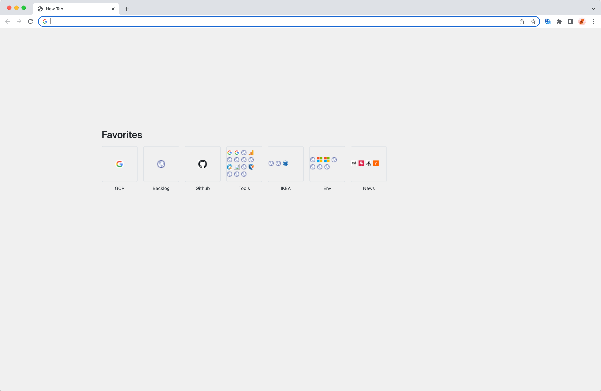
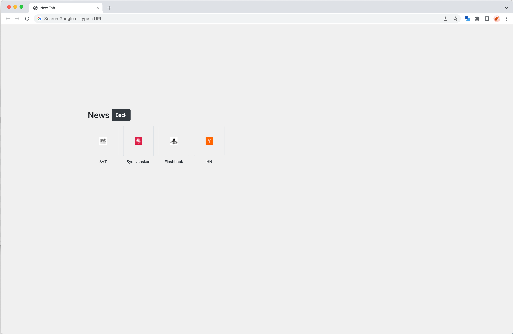

# New Tab Bookmarks
Chrome extensions that shows your bookmarks on the new tab page. That is all it does.

## Installation from source
* Run `yarn build`.
* Go to `chrome://extensions`.
* Enable `developer mode` in top right corner.
* Click `Load unpacked`, select the `dist` folder that was created by the build step.
* Open a new tab and click `keep` on the dialog that appears.

